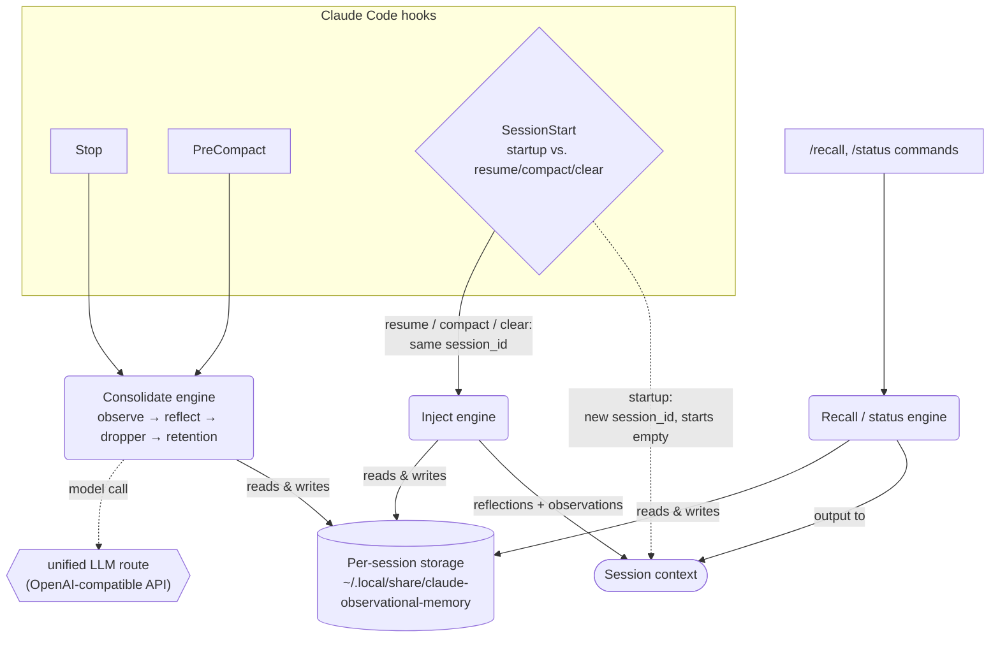

# claude-observational-memory

Observational memory for Claude Code — captures session **observations**, **reflects** them into durable memory, **injects** memory into new sessions, and **recalls** entries by id.

## Problem

Claude Code's context window is finite. A session worked on over weeks or months — resumed across many sittings, not run as one unbroken process — will eventually fill it, and Claude Code compacts: it summarizes and discards the raw transcript so the session can keep going. That's the built-in fix for a finite context window, but it's lossy — a decision, a constraint, a stated preference, why an approach was rejected, none of that survives unless it happened to make the auto-generated summary. That's what actually stops a session from spanning weeks or months in practice: not that it can't be resumed, but that each compaction along the way quietly erodes what it remembers.

This plugin closes that gap: it distills what happens during a session into small structured notes continuously, before compaction ever needs to discard anything, and re-injects them every time that session resumes. With it, one session genuinely can be worked on for weeks or months — compaction stops costing you context you'd otherwise have to re-derive or re-explain, no vector database, embedding model, or larger context window required.

## Install

This repo is a Claude Code **marketplace** named `observational-memory` containing one plugin, `claude-om`.

**From GitHub (shared):**

```text
/plugin marketplace add sovorn-c/claude-observational-memory
/plugin install claude-om@observational-memory
```

**From a local path (this machine):**

```text
/plugin marketplace add /Users/sovorn/dev/claude-observational-memory
/plugin install claude-om@observational-memory
```

After install, restart the session so hooks register.

**Updating:** third-party marketplaces like this one do **not** auto-update by default, and Claude Code's opt-in marketplace auto-update has a known bug where it fetches but never pulls the working tree, so the plugin can silently stay on the old version even with it enabled ([anthropics/claude-code#49410](https://github.com/anthropics/claude-code/issues/49410)) — don't rely on it. Run this manually whenever you want to pick up the latest commit:

```text
claude plugin marketplace update observational-memory
claude plugin update claude-om@observational-memory
```

or the interactive-session equivalent:

```text
/plugin marketplace update observational-memory
/reload-plugins
```

The first command re-pulls the marketplace repo and refreshes its catalog; the second applies the plugin version change. Run both together — updating the marketplace alone doesn't reload an already-installed plugin.

## Requirements

- `bash`, `jq`, `openssl` (id generation), `curl` (LLM calls)
- An API key from an OpenAI-compatible LLM provider, set as `llmApiKey` (see Configuration) — required for observe/reflect to run at all. [DeepSeek](https://api-docs.deepseek.com/) and [OpenCode Zen](https://opencode.ai/) (`opencode-go`) are cheap options to start with.

## Commands

```text
/claude-om:status           show storage usage and config
/claude-om:reflect          manually run a reflection pass
/claude-om:recall <id|q>    recall an entry by id or search
```

## How it works



Every session gets its own storage directory — observe, reflect, the dropper, and injection only ever touch that session's own files, so two sessions running concurrently (e.g. two terminal tabs) never race on the same file. A brand-new session (`SessionStart` with `source: startup`) always starts empty; memory only carries forward across `resume` and `compact` of the *same* session_id.

`recall` and `status` are slash commands, not hooks, so Claude Code never hands them a `session_id` the way it does for `SessionStart`/`Stop`/`PreCompact` — a plain `!`-executed subprocess gets no stdin payload and no env var for it. `status` is a config/storage diagnostic (is `llmApiKey` set, how big is everything, is the LLM route working) that was never meant to answer a per-session question, so it globs every session directory by design. `recall`'s id-lookup mode also globs by design, since an id is already a unique key — which session it lives in doesn't matter. `recall`'s text-search mode is different: every hook stamps a `current_session_id` pointer file on each invocation (`om_set_current_session`), and text search reads that pointer to default to searching only the current session, falling back to every session with `--all` or if no pointer has been stamped yet. That keeps ad-hoc searches from surfacing unrelated matches out of some other project's session.

`om-inject.sh` avoids re-showing the same content on every injection: each session tracks `lastFullFoldTs`, the boundary of its last full fold. Normally injection is **incremental** — only reflections/observations after that boundary — and that window keeps accumulating across multiple incremental injections until a full fold resets it. A **full fold** (show everything, move the boundary to now) fires instead if the active observation pool exceeds `observationsPoolMaxTokens`, or no fold has happened yet this session — so a consolidation backlog never silently falls outside the window.

Observe and reflect are gated by real token growth, not tool-call count: each assistant turn's recorded `usage` in the session transcript (`input_tokens` + cache tokens) gives an actual context-size delta since the last watermark. `Stop` is the closest thing Claude Code's hook model has to a continuous token clock, since there's no `turn_end`/background-task hook to poll continuously. No hook but `Stop` and `PreCompact` ever makes a model call, so tool calls themselves are never slowed down.

Memory lives in `~/.local/share/claude-observational-memory/`, one directory per session:

```text
sessions/<session_id>/observations.jsonl  distilled observations, each tagged with a relevance (low/medium/high/critical)
sessions/<session_id>/reflections.jsonl   durable facts/decisions/preferences distilled from this session's observations
sessions/<session_id>/dropped.jsonl       tombstones for observations archived out of this session's active pool (still recallable by id)
sessions/<session_id>/state.json          this session's transcript-line watermarks for the observe/reflect token clock
sessions/<session_id>/last_touch          epoch timestamp of this session's last hook activity, used by retention
retention_last_run   epoch timestamp of the last retention sweep
current_session_id    session_id most recently stamped by a hook; lets /recall default its text search to "this session" despite slash commands never receiving session_id directly
config.json           settings
model-caps.json        per-model cache of whether a configured reasoning_effort, and whether native json_schema structured output, was accepted (see Configuration)
debug/om.log          hook log
last-injected.md      most recent injected summary
```

## Configuration

Preferred: set env vars in `.claude/settings.json`'s `env` block — the same override mechanism Claude Code itself documents for `CLAUDE_CODE_AUTO_COMPACT_WINDOW` (see Notes below), so all tuning lives in one familiar place instead of a separate file. The env var name is the config key in `OM_UPPER_SNAKE_CASE`, e.g. `observeAfterTokens` -> `OM_OBSERVE_AFTER_TOKENS`. `CLAUDE_CODE_AUTO_COMPACT_WINDOW` isn't an `OM_*` var — it's Claude Code's own setting — but it belongs in the same block since it governs the compaction cadence this plugin's observe/reflect passes are timed against:

```json
{
  "env": {
    "CLAUDE_CODE_AUTO_COMPACT_WINDOW": "200000"
  }
}
```

Alternative: edit `~/.local/share/claude-observational-memory/config.json` directly (created on first run, values shown by `/claude-om:status`) if you need to change `observeAfterTokens`, `reflectAfterTokens`, or any of the other defaults below. Env vars take precedence over this file; this file takes precedence over the hardcoded defaults below.

```json
{
  "observationsPoolMaxTokens": 20000,
  "observationsPoolTargetTokens": 10000,
  "observeAfterTokens": 10000,
  "reflectAfterTokens": 20000,
  "sessionRetentionDays": 30,
  "reflectOnPreCompact": true,
  "injectOnSessionStart": true
}
```

| Key | Env var | Default | What it does |
|---|---|---|---|
| `observeAfterTokens` | `OM_OBSERVE_AFTER_TOKENS` | `10000` | Real token growth (from each turn's recorded `usage`, not an estimate) that triggers an observe pass. Lower = more frequent, smaller model calls. |
| `reflectAfterTokens` | `OM_REFLECT_AFTER_TOKENS` | `20000` | Real token growth of already-observed-but-unreflected content that triggers a reflect pass. |
| `observationsPoolTargetTokens` | `OM_OBSERVATIONS_POOL_TARGET_TOKENS` | `10000` | Steady-state size the dropper archives the active pool back down to after a successful reflect pass. Keep well below `observationsPoolMaxTokens`. |
| `observationsPoolMaxTokens` | `OM_OBSERVATIONS_POOL_MAX_TOKENS` | `20000` | Ceiling, not steady-state target. Caps how much `om-inject.sh` prints (× 4 chars/token), and forces a full fold instead of incremental once the active pool exceeds it. |
| `sessionRetentionDays` | `OM_SESSION_RETENTION_DAYS` | `30` | Days of no hook activity before a session's entire directory is deleted outright (not a tombstone). `0` or lower disables. Checked every `Stop`, pruned at most once/day. |
| `reflectOnPreCompact` | `OM_REFLECT_ON_PRE_COMPACT` | `true` | Whether the `PreCompact` safety-net reflect pass runs at all. |
| `injectOnSessionStart` | `OM_INJECT_ON_SESSION_START` | `true` | Whether `SessionStart` injects memory into context at all. |

### Unified LLM route

Observe and reflect always call an OpenAI-compatible `/chat/completions` provider — there is no bundled fallback, so `llmApiKey` must be set or observe/reflect silently no-op (logged to `debug/om.log`, never a hard failure). [DeepSeek](https://api-docs.deepseek.com/) and [OpenCode Zen](https://opencode.ai/) (`opencode-go`) are good picks to start with: both are cheap, and neither requires the OAuth/subscription juggling that trying to shell out to the `claude` CLI for this would (see Notes below for why that route was dropped). Just set:

```json
{
  "env": {
    "OM_LLM_PROVIDER": "deepseek",
    "OM_LLM_API_KEY": "sk-...",
    "OM_LLM_MODEL": "deepseek-v4-flash"
  }
}
```

`OM_LLM_MODEL` above is shown explicitly only because every other setting has a sane default — set it (or any of the table below) only if you want to override.

| Key (env var) | Default | What it does |
|---|---|---|
| `llmApiKey` (`OM_LLM_API_KEY`) | unset | **Required.** Observe/reflect no-op until this is set. Env-only — never written to `config.json` by `om_config_init`, so a secret never ends up in a plain file just from running the plugin. |
| `llmProvider` (`OM_LLM_PROVIDER`) | `openai` | One of `openai`, `openrouter`, `gemini`, `deepseek`, `ollama`, `opencode-go`. Resolves internally to that provider's API base URL, so you don't need to know or type one. |
| `llmModel` (`OM_LLM_MODEL`) | per-provider, see below | Optional for every provider except `opencode-go`, whose model catalog is curated per-account (check `/models` in the `opencode` CLI or your OpenCode Zen dashboard) and so requires it explicitly. Freely override the default for any provider. |
| `llmBaseUrl` (`OM_LLM_BASE_URL`) | resolved from `llmProvider` | Override for a provider/base URL not in the built-in list — self-hosted, a proxy, Azure OpenAI, a local vLLM server, etc. When set, `llmProvider` can be anything; it's just used as a cache-key label at that point. |
| `llmMaxTokens` (`OM_LLM_MAX_TOKENS`) | `8192` | Output token cap for unified-route calls, shared between a reasoning model's internal chain-of-thought and its actual answer. Reasoning models (e.g. `deepseek-v4-flash`) reason unconditionally regardless of `llmReasoningEffort`, and how many tokens that takes varies call to call — too low a cap and the reasoning alone can exhaust it, truncating the response (`finish_reason: "length"`) before any content is emitted at all. Logged distinctly in `debug/om.log` if it happens; raise this further if you see that message recur. |
| `llmReasoningEffort` (`OM_LLM_REASONING_EFFORT`) | `default` | `default` never sends `reasoning_effort` at all, so the model uses its own native default — no probing, no overhead. `low`, `medium`, or `high` sends that value; if the provider rejects it, the call transparently retries once without the field and remembers the outcome in `model-caps.json`, so future calls for that `llmProvider`+`llmModel`+`llmReasoningEffort` combination skip straight to whichever shape actually works. |

Per-provider default model, used when `llmModel` is unset:

| Provider | Default model |
|---|---|
| `openai` | `gpt-5.4-nano` |
| `openrouter` | `meta-llama/llama-3.1-8b-instruct` |
| `gemini` | `gemini-3.1-flash-lite` |
| `deepseek` | `deepseek-v4-flash` (`deepseek-chat` is deprecated 2026-07-24 — same model, renamed) |
| `ollama` | `llama3.2` |
| `opencode-go` | none — `llmModel` is required |

By default (`llmReasoningEffort` unset/`default`) the unified route never sends `reasoning_effort` at all — each model just runs in its own native mode, thinking or not. Set `llmReasoningEffort` to `low`, `medium`, or `high` to opt in; if the provider/model rejects that value, the call automatically falls back to omitting the field and caches the outcome per `llmProvider`+`llmModel`+`llmReasoningEffort` in `model-caps.json`, so it only ever probes once.

Structured output goes through the same kind of probe-and-cache: every observe/reflect call has a JSON schema to enforce, and "OpenAI-compatible" doesn't mean every provider actually supports `response_format: {type: "json_schema", strict: true}` on `/chat/completions` — DeepSeek's docs only list `json_object` (`json_schema` 400s), Ollama's OpenAI-compat route silently ignores `json_schema` rather than honoring or rejecting it, and OpenRouter only passes it through for models that support it themselves. The unified route tries native `json_schema` first for any `llmProvider`+`llmModel` not already cached otherwise; on empty content back, it retries once with `response_format: {type: "json_object"}` instead and caches that per `llmProvider`+`llmModel` in `model-caps.json`, so it's a one-time cost rather than a silent permanent failure. Either way, the schema is also always spelled out as plain text in the system prompt — the only signal a provider that ignores `response_format` outright (Ollama) actually receives.

## Notes and limitations

- Claude Code auto-compacts on its own as a session approaches the model's real context window, not a fixed token count — on a large window (e.g. ~1M tokens) that may not trigger until very late, delaying reflection along with it. Set `CLAUDE_CODE_AUTO_COMPACT_WINDOW` in the `env` block above (150,000–250,000 is a reasonable starting range), or `export` it before starting `claude`, to make it fire on a predictable schedule that matches this plugin's cadence. Only affects sessions started after the change. See [Explore the context window](https://code.claude.com/docs/en/context-window).
- `SessionStart` injects memory as plain-text stdout — the mechanism Claude Code documents for this hook — rather than a plugin hook's JSON `additionalContext` field, which is less consistently reliable for plugin-sourced hooks. The plain-stdout path used here hasn't been empirically confirmed reliable in this plugin either, though. If memory doesn't appear at startup, add the hook directly to `~/.claude/settings.json` as a workaround.
- This is a file-backed design, not an integration with Claude Code's own context ledger — plugins can't read that ledger or trigger compaction themselves, only react to it.
- The dropper is deterministic (oldest-covered-first), not model-judged — cheaper than asking a model which observations are safe to remove, at the cost of nuance (it can't choose to keep an old-but-still-load-bearing observation just because it's technically covered).
- The unified LLM route assumes an OpenAI-compatible `/chat/completions` shape; a provider with a different auth header or response envelope needs changes to `om_call_model_unified` in `scripts/om-config.sh`.
- There is no way to surface "observe/reflect just ran" as a visible line in the user's normal chat view. A hook's JSON `systemMessage` field is documented to do exactly this, but only works for hooks registered inline in the user's own `~/.claude/settings.json` — plugin-dispatched hooks (this plugin's `hooks.json`) have their stdout silently unparsed by Claude Code, so `systemMessage` never renders. Confirmed via [anthropics/claude-code#50542](https://github.com/anthropics/claude-code/issues/50542) (closed not-planned) and [#10875](https://github.com/anthropics/claude-code/issues/10875). Don't re-add this without checking whether those issues have since been fixed.
- Earlier versions shelled out to the `claude` CLI (`claude -p --bare ...`) for observe/reflect, piggybacking on Claude Code's own auth. That was dropped: `--bare` mode — needed to keep each call small and cheap — explicitly disables OAuth/keychain auth and requires `ANTHROPIC_API_KEY` regardless (per Claude Code's own docs), so it was never actually free of a separate API key; and without `--bare`, plain `claude -p` reloads hooks/skills/plugins/CLAUDE.md on every call, tens of thousands of tokens of fixed overhead for what's otherwise a small extraction prompt. The unified LLM route avoids both problems.

## License

MIT
